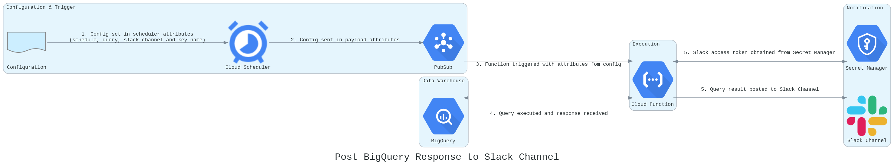

# transformationflow/cloudfunctions

Cloud functions to support development, management and monitoring of BigQuery data transformation flows.

<details>
<summary> post-bigquery-response-to-slack </summary>
  
  ### Overview
  This function will execute a single SQL query and post the response to a Slack channel on a schedule.  Any logic needs to be written in the SQL.

  ### Architecture
  
  #### Resources
  The deployed architecture leverages the following Google Cloud Platform resources:

  sequence | resource | default_name | description
  :-: | --- | --- | ---
  1 | Cloud Scheduler | `post-bigquery-response-to-slack` |Serverless PubSub trigger with configurable attributes
  2 | PubSub | `post-bigquery-response-to-slack` | Messaging to trigger Cloud Function with configured attributes
  3 | Cloud Function | `post-bigquery-response-to-slack` | Python 3.8 function [post-bigquery-response-to-slack](https://github.com/transformationflow/cloudfunctions/tree/main/post-bigquery-response-to-slack)
  4 | BigQuery | n/a |Accessed via google-cloud-bigquery client library (with additional drive scopes for federated table access)
  5 | Secret Manager | `slack-data-monitor` | Secure storage of Slack Access key

  #### Resource Flow
  

  ### Configuration
  Configuration is set via the following parameters in the Cloud Scheduler job: 
  parameter | section | description
  --- | --- | ---
  Frequency | Job Definition | Cron schedule for job triggering
  Pub/Sub Topic | Job Configuration | PubSub topic which triggers the deployed cloud function (default: `post-bigquery-response-to-slack`)
  `slack_access_token_name` | Message Attributes | Name of secret in Secret Manager
  `slack_channel` | Message Attributes | Channel to post query response (prefixed by '#' e.g. `#data-monitoring`)
  `sql_query` | Message Attributes | SQL query to execute.  This must return a column called post_text.

  To add an additional notifier, create a new Cloud Scheduler job with the required parameters.

  A single string will be posted to the channel, however it is possible to construct sentences with line breaks from query column values using the following native BigQuery functions:

  - [FORMAT](https://cloud.google.com/bigquery/docs/reference/standard-sql/string_functions#format_string) - allows injection of column values into a string using %-prefixed format specifiers (e.g. %s - string, %d - integer).
  - [ARRAY_AGG](https://cloud.google.com/bigquery/docs/reference/standard-sql/aggregate_functions#array_agg) - aggregates a column (containing e.g. strings with injected column values) into an array.
  - [ARRAY_TO_STRING](https://cloud.google.com/bigquery/docs/reference/standard-sql/array_functions#array_to_string) - converts an array into a delimited string. Delimiting on '\n' results in each sentence being written on a new line.

  #### Example Query
  The following query structure will output a single string as `post_text`, which will be posted to the specified Slack channel. Once a query is tested in BigQuery, this can be directly pasted into the `sql_query` attribute in the relevant Cloud Scheduler Job, and the `post_text` will then be posted to a slack channel on the defined schedule:


```
WITH
example_data_errors AS (
SELECT 14 AS critical_errors, 6 AS minor_errors, 4934 AS new_records, DATE('2021-06-21') AS ingestion_date UNION ALL
SELECT 25 AS critical_errors, 34 AS minor_errors, 7856 AS new_records, DATE('2021-06-20') AS ingestion_date UNION ALL
SELECT 45 AS critical_errors, 65 AS minor_errors, 9843 AS new_records, DATE('2021-06-19') AS ingestion_date
)

SELECT 
ARRAY_TO_STRING( ARRAY_AGG(
    FORMAT('ALERT: %d critical error(s) and %d minor error(s) from %d records on %t',
    critical_errors, minor_errors, new_records, ingestion_date)
), '\n') AS post_text     
FROM example_data_errors      
WHERE ingestion_date >= DATE_SUB('2021-06-21', INTERVAL 2 DAY)

```

This results in the following formatted and line-broken string as `post_text`:

```
ALERT: 14 critical error(s) and 6 minor error(s) from 4934 records on 2021-06-21
ALERT: 25 critical error(s) and 34 minor error(s) from 7856 records on 2021-06-20
ALERT: 45 critical error(s) and 65 minor error(s) from 9843 records on 2021-06-19
```

</details>
